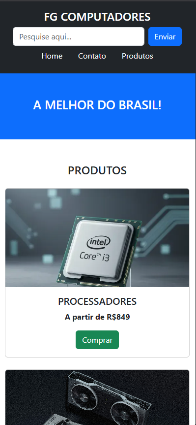
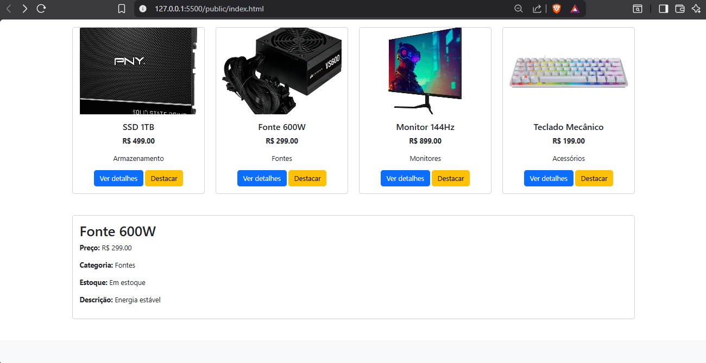
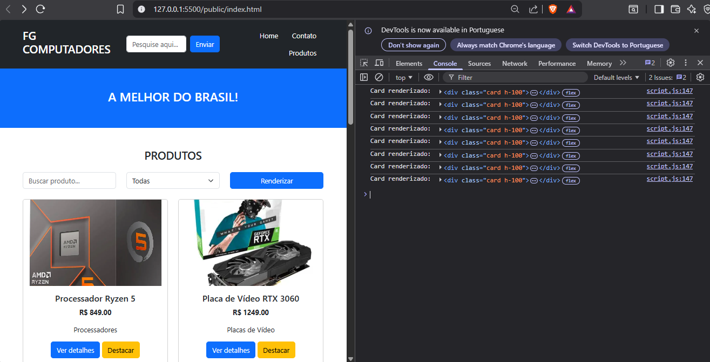

# Trabalho Prático - Semana 9

Nesta atividade, você vai montar um programa para praticar funções em JavaScript e a manipulação do DOM, criando uma tela simples no estilo eCommerce que lista produtos em cards a partir de um objeto JSON (array de produtos).

Você vai usar métodos e propriedades do document e seus nodos para criar elementos, definir atributos, alterar conteúdo, estilizar e registrar eventos.

A atividade foi pensada para ser concluída em até 1h no laboratório, usando Visual Studio Code e um navegador (DevTools/Console).

**IMPORTANTE:** Você deve trabalhar e alterar apenas arquivos dentro da pasta **`public`,** mantendo os arquivos **`index.html`** , **`styles.css`** e **`script.js`** com estes nomes. Deixe todos os demais arquivos e pastas desse repositório inalterados. **PRESTE MUITA ATENÇÃO NISSO.**

## Informações Gerais

- Nome:Pedro Henrique Faria Godinho
- Matricula:1658056
- Proposta de projeto escolhida:Loja de Informatica/ Proposta 4
- Breve descrição sobre seu projeto:Este projeto consiste na criação de uma página web utilizando HTML e CSS para apresentar produtos de informática. Nesta versão (v4.0), foi desenvolvido um mini e-commerce em JavaScript que exibe produtos em cards a partir de um JSON, com busca, filtro por categoria, visualização de detalhes e destaque, utilizando manipulação do DOM e eventos.

## Print do Wireframe criado

## Print da versão responsiva com CSS puro

## Print da versão responsiva com Bootstrap

## Print da versão responsiva Mobile

## Print da versão responsiva Desktop

## Print da versão responsiva Mobile com o Bootstrap

## Print da versão responsiva Desktop com o Bootstrap

## Print da versão do site com o Java Script

## Print da versão do site com o Java Script (Console)

