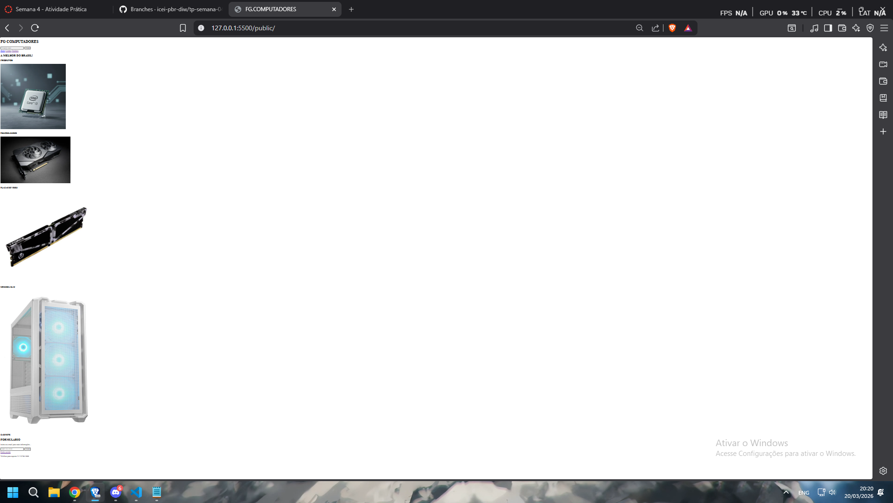
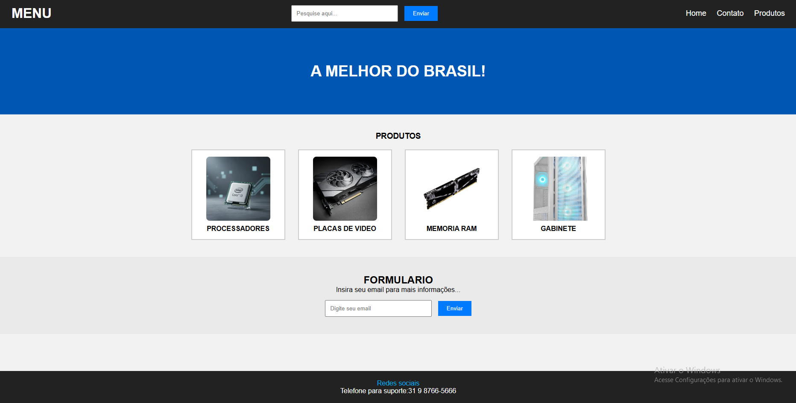
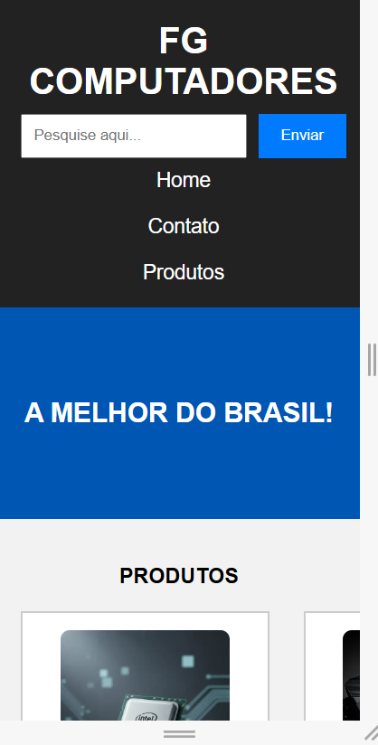
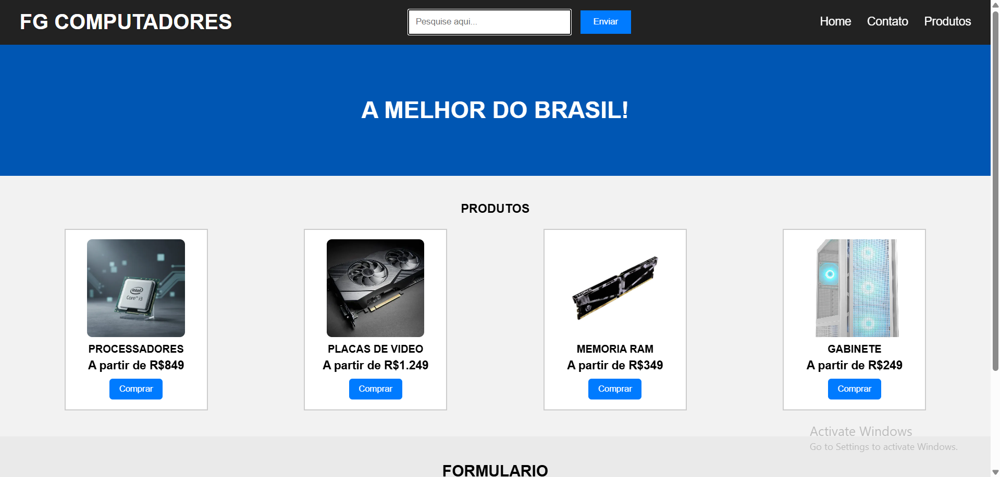

# Trabalho Prático - Semana 04 e 05

Dessa vez, vamos dar sequência ao projeto iniciado na semana passada. Se você ainda não fez o projeto da semana anterior, fique atento, se programe e procure colocar as atividades em dia. Volte lá, leia tudo e faça sua parte pois essa atividade depende da atividade anterior..

Nessa atividade,vamos evoluir o projeto para que a home-page funcione bem tanto no celular quanto no desktop, entendendo também como é o processo gradativo e colaborativo de desenvolvimento de um software, registrando cada etapa no histórico de commits do repositório do git/GitHub.

**IMPORTANTE:** Você deve trabalhar e alterar apenas arquivos dentro da pasta **`public`,** mantendo os arquivos **`index.html`** e **`styles.css`** com estes nomes. Deixe todos os demais arquivos e pastas desse repositório inalterados. **PRESTE MUITA ATENÇÃO NISSO.**

## Informações Gerais

- Nome:Pedro Henrique Faria Godinho
- Matricula:1658056
- Proposta de projeto escolhida:Loja de Informatica/ Proposta 4
- Breve descrição sobre seu projeto:Este projeto consiste na criação de uma página web utilizando HTML e CSS para apresentar produtos de informática. O site simula uma loja virtual chamada FG Computadores, exibindo itens como processadores, placas de vídeo, memória RAM e gabinetes.

A página foi estruturada com HTML semântico e estilizada com CSS, utilizando Flexbox para alinhar os elementos e organizar o layout de forma clara e responsiva. Também foi incluído um formulário simples para contato.
## Print do Wireframe criado

## Print da versão responsiva com CSS puro

## Print da versão responsiva com Bootstrap

## Print da versão responsiva Mobile

## Print da versão responsiva Desktop

